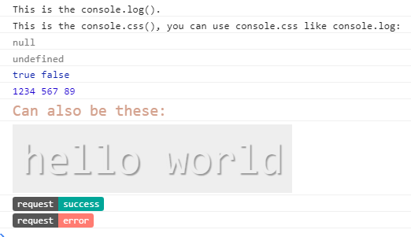

# console.css
> console.css() can print text with css

```
console.css([{
  text: 'request',
  style: {
    color: '#fff',
    background: '#555',
    borderRadius: '3px 0 0 3px',
    padding: '2px 6px',
    fontSize: '8px'
  }
}, {
  text: 'successful',
  style: {
    color: '#fff',
    background: '#00a698',
    borderRadius: '0 3px 3px 0',
    padding: '2px 6px',
    fontSize: '8px'
  }
}])
```
